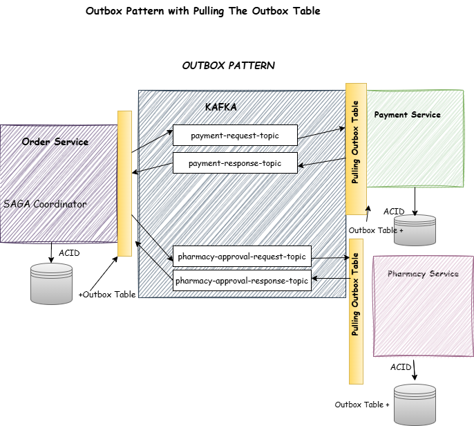
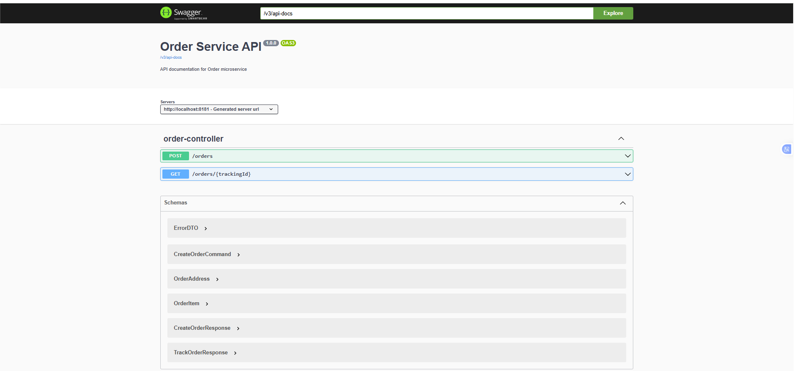
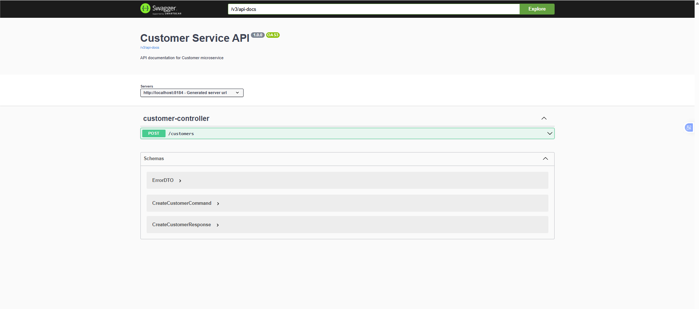
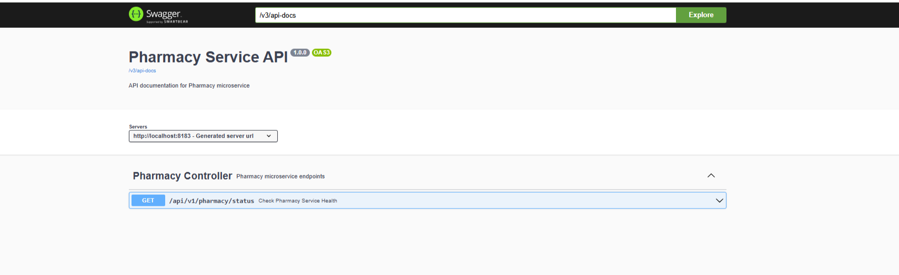
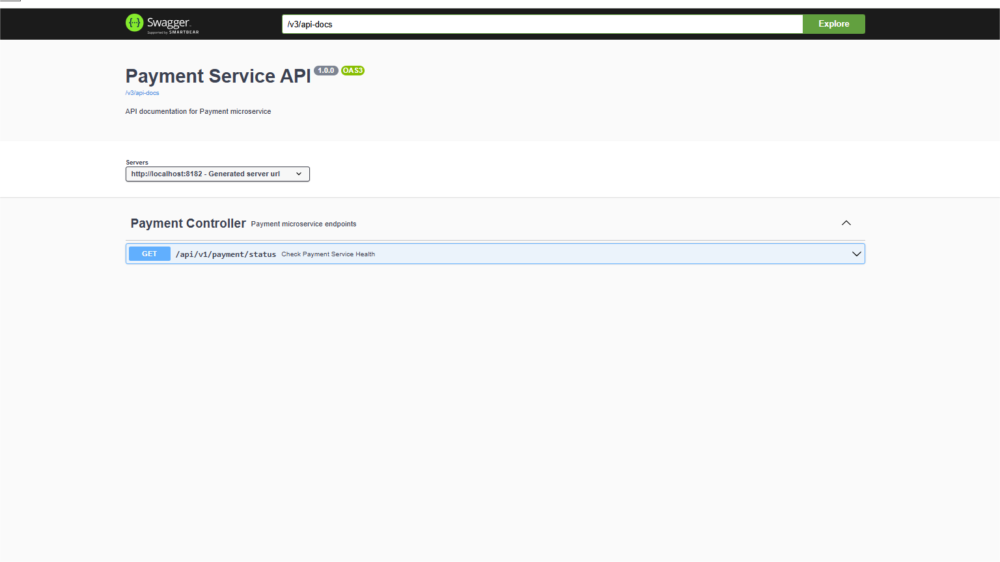
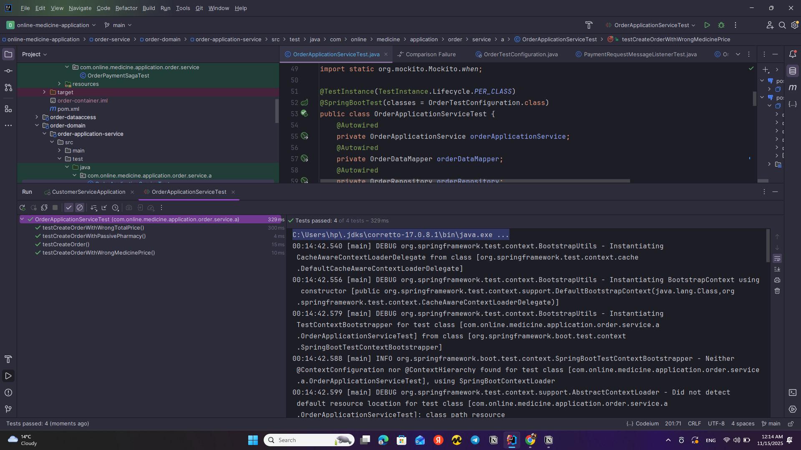
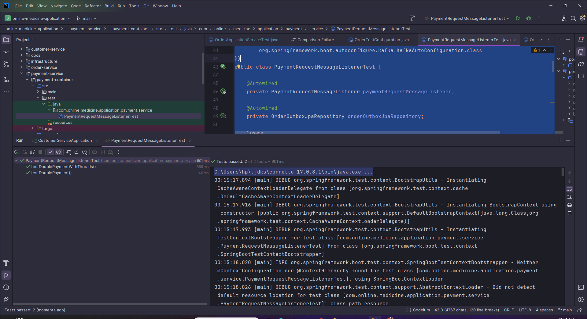
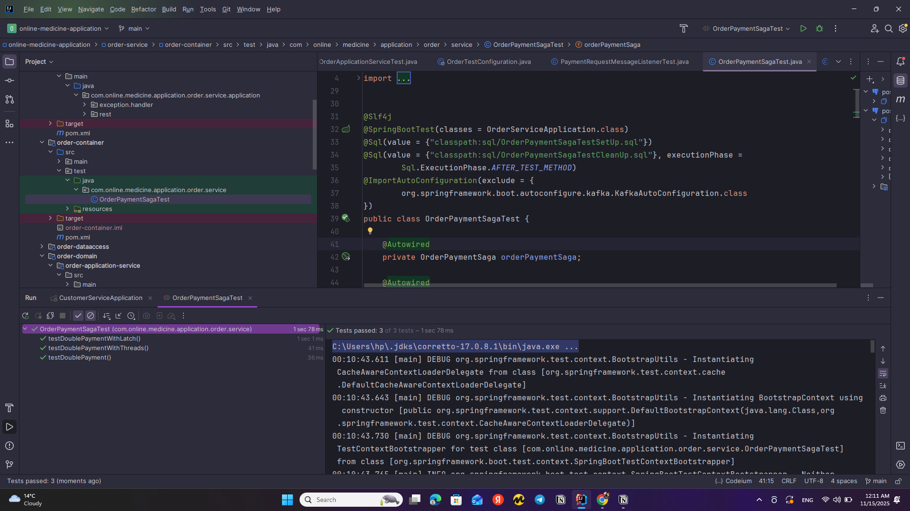

#  Online Medicine Application


A **microservices-based backend system** for an online pharmacy, built with Java and Spring Boot following **Clean Architecture**, **Hexagonal Architecture**,  and **Domain-Driven Design (DDD)** principles. This project was developed as part of the Udemy course [*Microservices: Clean Architecture, DDD, SAGA, Outbox & Kafka*](https://www.udemy.com/course/microservices-clean-architecture-ddd-saga-outbox-kafka/).

##  Features

- ✅ Microservices-based backend (Order, Pharmacy, Customer, Payment)
- ✅ Event-driven communication using **Apache Kafka**
- ✅ Domain-driven business logic using **DDD principles**
- ✅ **Clean Architecture** and **Hexagonal Architecture** structure
- ✅ **SAGA** pattern for distributed transaction management
- ✅ **Outbox Pattern** for reliable message delivery
- ✅ **CQRS Pattern** in selected use cases
- ✅ PostgreSQL for data persistence
- ✅ Docker + Docker Compose for containerization
- ✅ Kubernetes deployment support

##  Microservices Included

| Service   | Description |
|-----------|-------------|
| **Order Service** | Handles medicine orders, integrates with payment and pharmacy |
| **Customer Service** | Manages customer data and credit history |
| **Pharmacy Service** | Stores medicine and pharmacy inventory |
| **Payment Service** | Processes payments, uses SAGA and Outbox patterns |

##  Tech Stack

- **Java 17**
- **Spring Boot 3**
- **Spring Data JPA**
- **Spring Kafka**
- **PostgreSQL**
- **Kafka (Confluent Platform)**
- **Docker & Docker Compose**
- **Kubernetes (Local & GKE-ready)**

## ⚙️ Architecture Patterns

-  **Clean Architecture**
-  **Hexagonal Architecture (Ports & Adapters)**
-  **Domain-Driven Design (DDD)**
-  **SAGA Pattern**
-  **Outbox Pattern**
-  **CQRS Pattern**

##  System Architecture

The diagram below shows the complete communication flow between all microservices using Kafka, Outbox Pattern, and SAGA orchestration:


### Outbox Pattern Architecture

To ensure exactly-once message delivery and avoid race conditions or distributed transaction issues, every service writes messages to an Outbox table inside the same ACID transaction as the domain update.

A scheduled Outbox Publisher then reads these records and pushes them to Kafka.

The following diagram illustrates the Order → Payment → Pharmacy outbox event flow:



### SAGA Workflow Overview

The order workflow uses SAGA to manage distributed transactions across:

Order Service

Payment Service

Pharmacy Service

Each service publishes events via the Outbox table.
SAGA ensures that:

✔ A payment is never processed twice
✔ A pharmacy approval cannot be duplicated
✔ Failures trigger compensating actions
✔ System remains eventually consistent


### CQRS Usage

Certain operations (like reading order status, pharmacy inventory checks, payment verification) use separate:

Command Model (domain logic + outbox writing)

Query Model (read-optimized, sometimes cached)

### Hexagonal Architecture (Ports & Adapters)

Each service has:

Domain Layer (entities, aggregates, policies)

Application Layer (use cases)

Ports (interfaces)

Adapters (Kafka message publishers, DB repositories)

Configuration Layer

This ensures:

✔ Loose coupling
✔ Testability
✔ Replaceable adapters (Kafka → RabbitMQ possible)
✔ Clean separation of domain and infrastructure


##  API Documentation (Swagger UI)

Every microservice in this system exposes OpenAPI 3.0-based Swagger UI documentation.

Swagger is available automatically when the services run (Docker, IDE, or standalone jar).

Below are the Swagger URLs and screenshots for each microservice:

---

###  Order Service
 **URL:**  
http://localhost:8181/swagger-ui/index.html


**Screenshot:**  


---

###  Customer Service  
 **URL:**  
http://localhost:8184/swagger-ui/index.html


**Screenshot:**  


---

###  Pharmacy Service  
 **URL:**  
http://localhost:8183/swagger-ui/index.html


**Screenshot:**  


---

###  Payment Service  
 **URL:**  
http://localhost:8182/swagger-ui/index.html

**Screenshot:**  


---

## 📂 Project Structure

```bash
online-medicine-application/
├── customer-service/
├── pharmacy-service/
├── order-service/
├── payment-service/
├── common/                # Shared libraries and DTOs
├── docker-compose.yml
├── k8s/                   # Kubernetes manifests
└── README.md
```

## 🧪 How to Run

### 1️⃣ Clone the Repository

```bash
git clone https://github.com/tomrist9/online-medicine-application.git
cd online-medicine-application
```

### 2️⃣ Run with Docker Compose
```bash
docker-compose up -d

```
This will start all core microservices (Order, Customer, Pharmacy, Payment) along with Kafka and PostgreSQL containers.


### 3️⃣ Run Microservices Individually

Each microservice can also be run independently from its module using your IDE or via Maven:

```bash
mvn spring-boot:run -pl order-service

```
### 4️⃣ Test Kafka Events

Once all containers are up, you can open the Kafka UI at:
```bash
📍 http://localhost:8081


---
```
# 🧪 Testing

This project includes extensive unit, integration, and concurrency tests to ensure reliability across all microservices. The test suite validates domain logic, SAGA workflow correctness, outbox consistency, idempotency, and concurrency behavior in distributed systems.

## ✔️ Order Service Tests
### Unit Tests

Validates total price calculations

Detects inconsistent item pricing

Prevents ordering from inactive pharmacies

Ensures domain entity & value object invariants

Tests order initialization and domain events

Ensures Outbox payload is serialized correctly



### Integration Tests

Complete order creation flow using DDD

SAGA initialization & outbox message generation

PostgreSQL repository interactions

OrderRepository, PaymentOutboxRepository, PharmacyRepository coordination

## ✔️ Payment Service Tests
Concurrency & Idempotency Tests

The payment service includes advanced race-condition tests to guarantee correctness:

Double payment prevention

Parallel message processing using threads

CountDownLatch synchronization tests

Ensures only one payment is processed, even if multiple identical events arrive

Validates optimistic locking (PostgreSQL)

Ensures Outbox table remains consistent and idempotent



## ✔️ SAGA Workflow Tests (OrderPaymentSaga)

The SAGA tests validate that the workflow is safe, atomic, and idempotent:

testDoublePayment()

testDoublePaymentWithThreads()

testDoublePaymentWithLatch()



These tests ensure:

✔ Only one SagaStatus.PROCESSING outbox record exists
✔ SAGA executes exactly once, even under concurrency
✔ Duplicate events cannot break system state

##  Tools Used

JUnit 5

Mockito

Spring Boot Test

PostgreSQL

H2 (optional)

Concurrency utilities (ThreadPool, Executors, CountDownLatch)

SQL setup / cleanup scripts

## 📈 Summary

This application includes production-grade tests that simulate real distributed system behavior, ensuring:

✔ Reliability
✔ Idempotency
✔ Correct SAGA execution
✔ Outbox consistency
✔ Strong domain validation
✔ Race-condition safety
