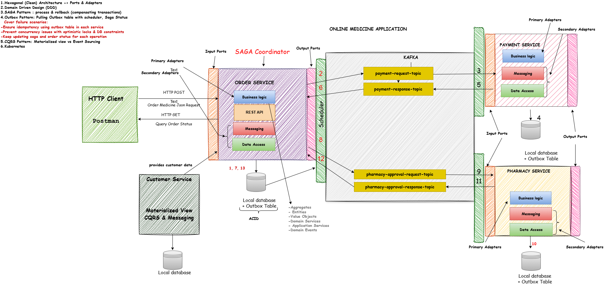

#  Online Medicine Application

A **microservices-based backend system** for an online pharmacy, built with Java and Spring Boot following **Clean Architecture**, **Hexagonal Architecture**,  and **Domain-Driven Design (DDD)** principles. This project was developed as part of the Udemy course [*Microservices: Clean Architecture, DDD, SAGA, Outbox & Kafka*](https://www.udemy.com/course/microservices-clean-architecture-ddd-saga-outbox-kafka/).

##  Features

- ✅ Microservices-based backend (Order, Pharmacy, Customer, Payment)
- ✅ Event-driven communication using **Apache Kafka**
- ✅ Domain-driven business logic using **DDD principles**
- ✅ **Clean Architecture** and **Hexagonal Architecture** structure
- ✅ **SAGA** pattern for distributed transaction management
- ✅ **Outbox Pattern** for reliable message delivery
- ✅ **CQRS Pattern** in selected use cases
- ✅ PostgreSQL for data persistence
- ✅ Docker + Docker Compose for containerization
- ✅ Kubernetes deployment support

##  Microservices Included

| Service   | Description |
|-----------|-------------|
| **Order Service** | Handles medicine orders, integrates with payment and pharmacy |
| **Customer Service** | Manages customer data and credit history |
| **Pharmacy Service** | Stores medicine and pharmacy inventory |
| **Payment Service** | Processes payments, uses SAGA and Outbox patterns |

##  Tech Stack

- **Java 17**
- **Spring Boot 3**
- **Spring Data JPA**
- **Spring Kafka**
- **PostgreSQL**
- **Kafka (Confluent Platform)**
- **Docker & Docker Compose**
- **Kubernetes (Local & GKE-ready)**

## ⚙️ Architecture Patterns

- 🧼 **Clean Architecture**
- 🛠️ **Hexagonal Architecture (Ports & Adapters)**
- 🧠 **Domain-Driven Design (DDD)**
- 🔁 **SAGA Pattern**
- 📤 **Outbox Pattern**
- ⚔️ **CQRS Pattern**

## 🧩 System Architecture

The following diagram illustrates how the services interact via Kafka, 
applying SAGA, Outbox, and CQRS patterns within a Hexagonal Architecture design.




## 📂 Project Structure

```bash
online-medicine-application/
├── customer-service/
├── pharmacy-service/
├── order-service/
├── payment-service/
├── common/                # Shared libraries and DTOs
├── docker-compose.yml
├── k8s/                   # Kubernetes manifests
└── README.md
```

## 🧪 How to Run

### 1️⃣ Clone the Repository

```bash
git clone https://github.com/tomrist9/online-medicine-application.git
cd online-medicine-application
```

2️⃣ Run with Docker Compose
docker-compose up -d

```
This will start all core microservices (Order, Customer, Pharmacy, Payment) along with Kafka and PostgreSQL containers.
```
3️⃣ Run Microservices Individually

Each microservice can also be run independently from its module using your IDE or via Gradle:

./gradlew :order-service:bootRun

```
4️⃣ Test Kafka Events

Once all containers are up, you can open the Kafka UI at:
📍 http://localhost:8081


---


